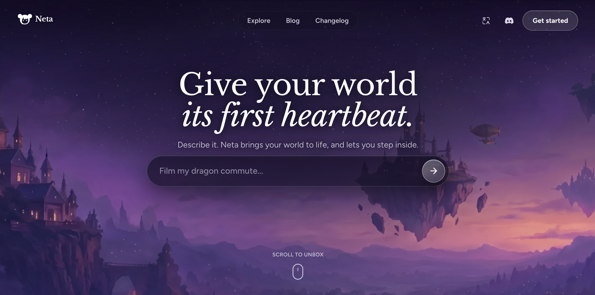

<p align="center">
  
</p>

<p align="center">
  <a href="LICENSE"></a>
  <a href="https://github.com/LogicOber/Worldview-Skills"></a>
  <a href="https://skills.sh"></a>
</p>

<p align="center"><a href="./README.md"><strong>English</strong></a> · <a href="./README.zh-CN.md">简体中文</a></p>

# Worldview Skills

Build playable games, high-fidelity game scenes, films, reusable visual assets, and complete stories with Claude Code, Codex, or another Agent that supports `SKILL.md`.

Give an Agent this repository URL and a sentence describing what you want. It installs the Skills and chooses the relevant ones. If you are still developing a game idea, it starts with the story, player activities, discoveries, and estimated play time, then presents the draft for your review before implementation. If you have already asked it to build the game and choose the details, it can carry that plan through production and verification. You do not need to assemble a workflow or remember which Skill to call next. Slash entries remain available for precise control over one stage.

The repository currently includes **75 installable Skills** for:

- writing a complete game story and planning exploration, surprises, choices, and play time before implementation;
- expanding a short premise into a complete horror experience or a researched single-ending game campaign, building a new playable slice, or rebuilding an existing game's presentation;
- composing horror experiences and implementing mechanics such as pursuit, hiding, sound detection, scarce saves, investigation, routine corruption, procedural incidents, and death loops;
- studying games from screenshots and videos, reconstructing lived player experience, turning observed chase architecture into route contracts, and selecting a safe 3D asset-production route;
- designing boss fights, ability kits, levels, puzzles, branching choices, and playable 2D formats;
- creating consistent characters, bosses, environments, props, sprites, and visual effects;
- producing short films, cutscenes, action sequences, product videos, and social clips;
- writing mysteries, thrillers, romances, and hero journeys.

## Contents

- [Sponsor](#sponsor)
- [1. Install and update](#1-install-and-update)
- [2. Game creation](#2-game-creation)
  - [2.1 Story planning and game production](#21-story-planning-and-game-production)
  - [2.2 Game categories](#22-game-categories)
    - [2.2.1 Horror games](#221-horror-games)
  - [2.3 Game analysis](#23-game-analysis)
  - [2.4 General game design and 2D creation](#24-general-game-design-and-2d-creation)
  - [2.5 3D asset creation](#25-3d-asset-creation)
- [3. Film and video production](#3-film-and-video-production)
- [4. Story writing](#4-story-writing)
- [5. Community showcase](#5-community-showcase)
- [6. Repository layout](#6-repository-layout)
- [7. License and sources](#7-license-and-sources)

## Sponsor

[Neta](https://neta.art): Give your world its first heartbeat. Describe it. Neta brings your world to life, and lets you step inside.

[](https://neta.art)

## 1. Install and update

Install all 75 Skills for every supported Agent:

```bash
npx skills add LogicOber/Worldview-Skills --all
```

Install only one Skill:

```bash
npx skills add LogicOber/Worldview-Skills \
  --skill worldview-game-high-fidelity-vertical-slice
```

Update every installed Skill, or name one Skill to update only that entry:

```bash
npx skills update
npx skills update worldview-game-high-fidelity-vertical-slice
```

These commands follow the official [Vercel Skills CLI](https://github.com/vercel-labs/skills#readme). Re-run the full `add ... --all` command when you also want Skills published after your original installation.

After installation, call a Skill by its Slash name and write the request underneath it:

```text
/worldview-game-high-fidelity-vertical-slice

Build a five-minute third-person chapter about a courier carrying a glass seed
through a tide station while the water rises. Use the current repository.
```

## 2. Game creation

Game Skills are grouped by production scope, game category, analysis, general design, and asset creation. New genres belong under **2.2 Game categories**, beside horror games, rather than being mixed into the mechanic or asset lists.

### 2.1 Story planning and game production

**Still finding the story?** Start with Story and Play Plan. The Agent writes the scenes and ending, works out what players explore and do, estimates the time, and checks early guesses and missed clues. A story-first request stays in writing until you choose to proceed. Installing every Skill does not start every production stage.

| Slash entry | Use it for | Result |
| --- | --- | --- |
| [`/worldview-game-story-and-play-plan`](skills/game-production/worldview-game-story-and-play-plan/README.md) | Develop an idea into a complete game story before implementation. | Readable scenes and dialogue, exploration and reveal plan, estimated first-play and retry times, and a review of early solutions, missed clues, and ending logic. |
| [`/worldview-game-horror-production`](skills/game-production/worldview-game-horror-production/README.md) | Turn a short horror premise into a complete experience with connected mechanics, memorable spaces, a learnable threat, fear rhythm, recovery, and a tested ending. | Horror production contract, experience timeline, map/route plan, selected mechanic contracts, grey-box order, sensory plan, verification journeys, and a playable or implementation-ready handoff. |
| [`/worldview-game-single-ending-campaign`](skills/game-production/worldview-game-single-ending-campaign/README.md) | Expand a short premise into an original, researched, story-driven game with one canonical ending and a substantial playable world. | Dated research ledger, original fictionalization, complete route, connected gameplay systems, maps, NPCs, items, state/save logic, runtime evidence, and a verified build or deployment URL. |
| [`/worldview-game-high-fidelity-vertical-slice`](skills/game-production/worldview-game-high-fidelity-vertical-slice/README.md) | Turn a story, place, or game idea into one polished 2D or 3D playable chapter. | Playable core, three to five real gameplay states, original asset plan, integrated presentation, runtime captures, performance evidence, and handoff. |
| [`/worldview-game-runtime-visual-fidelity-rebuild`](skills/game-production/worldview-game-runtime-visual-fidelity-rebuild/README.md) | Replace the generic or inconsistent presentation of a game that already works. | Protected gameplay baseline, rebuilt camera/assets/materials/lighting/VFX/UI/audio, same-state comparisons, regression journeys, and measured performance. |

For the strongest result in Codex, use **GPT-6 Astra + Max** for one deep end-to-end task. Use **Astra + Ultra** when asset production, runtime implementation, and verification can run as separate subagent tracks. In the API, `max` is a `reasoning.effort` value; Ultra is Codex orchestration rather than an API effort value. See the official [GPT-6 Astra model page](https://developers.openai.com/api/docs/models/gpt-6-astra) and [Codex model guide](https://learn.chatgpt.com/docs/models).

Image generation, Blender MCP, another DCC, browser or engine automation, and profilers are used when they are configured and authorized. Each Skill also defines a fallback when one of those capabilities is unavailable.

[Choose a game-production Skill →](skills/game-production/README.md)

### 2.2 Game categories

Each game category has its own complete-production entry followed by numbered mechanic chapters. Horror is the first category; future categories will use the same structure.

#### 2.2.1 Horror games

For a rough horror idea, the Agent can begin with [Story and Play Plan](skills/game-production/worldview-game-story-and-play-plan/README.md), then hand the reviewed story to Horror Production when implementation is in scope.

Describe the game you want; the Agent can choose and combine the relevant Skills, establish their shared state, implement them in a safe order, and verify the result. The 27 mechanic Skills below are available when you want precise control, but **you do not need to memorize or call them one by one**.

> [!TIP]
> For the simplest workflow, give the Agent this repository URL and your premise. Tell it to read the repository, install what it needs, and choose the Skills itself. Slash calls are optional controls for a specific mechanic—not a workflow the user must assemble manually.

**Horror chapter guide:** [01 complete game](#01-start-with-a-complete-horror-game) · [02 pursuit and hiding](#02-pursuit-hiding-and-threat-behavior) · [03 survival](#03-survival-resources-and-bodily-risk) · [04 investigation](#04-investigation-instruments-and-interrupted-objectives) · [05 trust and cooperation](#05-trust-memory-and-shared-knowledge) · [06 journey and pacing](#06-journey-pacing-and-social-pressure) · [07 finished-game effects](#07-what-these-skills-change-in-the-finished-game)

<a id="01-start-with-a-complete-horror-game"></a>

##### 01. Start with a complete horror game 🎬

Use the main production Skill when you have a story, setting, image, or rough idea and want the Agent to decide which mechanics belong together. It owns the experience timeline, map and route plan, mechanic routing, implementation order, runtime verification, and delivery.

| 🎮&nbsp;Main&nbsp;Slash&nbsp;Skill&nbsp;—&nbsp;start&nbsp;here | What it does | Example input |
| --- | --- | --- |
| [`/worldview-game-horror-production`](skills/game-production/worldview-game-horror-production/README.md) | Turns a short premise into one coherent horror game, chooses only mechanics that change play, connects their state owners, builds the graybox before polish, and verifies success, failure, recovery, save/load, and the ending. | “Make a 25-minute English first-person horror game in an abandoned ferry terminal. One canonical ending. Reuse this project, choose the mechanics yourself, implement it, and give me a playable URL.” |

You can use the repository without naming any Skill:

```text
Read https://github.com/LogicOber/Worldview-Skills, install the Skills you need,
and make a 30-minute English horror game from this premise: a night courier must
deliver one sealed case through a flooded district while familiar safe places
stop recognizing her. Use one canonical ending. Choose the mechanics yourself,
reuse the current project, implement the game, test failure and restart, and give
me the playable result. Ask only questions that would materially change it.
```

The Agent should not turn that prompt into a checklist of every mechanic. It selects the smallest useful set, gives every shared state one owner, and leaves out systems that do not improve the intended experience.

<a id="02-pursuit-hiding-and-threat-behavior"></a>

##### 02. Pursuit, hiding, and threat behavior 🏃

| 🧩&nbsp;Slash&nbsp;Skill&nbsp;—&nbsp;direct&nbsp;control | What it helps the Agent build | Example input |
| --- | --- | --- |
| [`/worldview-game-lure-hide-escape`](skills/game-mechanics-horror/worldview-game-lure-hide-escape/README.md) | A bounded encounter where the player creates a false sound, breaks observation, enters real cover, judges the search, and escapes through a measured opening. | “On the hotel floor, let me throw a bottle, hide beneath the bed, and leave by the service door while the creature searches the wrong room.” |
| [`/worldview-game-observation-gated-stalker`](skills/game-mechanics-horror/worldview-game-observation-gated-stalker/README.md) | A threat that freezes or loses permission to harm while genuinely observed, including camera edges, occlusion, multiplayer authority, and fair contact timing. | “The statue may advance only when no active player camera can see its body; make pillars and looking away part of the route.” |
| [`/worldview-game-sound-detection-and-distraction`](skills/game-mechanics-horror/worldview-game-sound-detection-and-distraction/README.md) | Causal footsteps, surfaces, devices, distractions, propagation, per-listener memory, and readable heard/unheard outcomes without giving enemies the player's transform. | “Make metal floors dangerous, carpet quiet, and a wind-up radio strong enough to redirect one guard through the east corridor.” |
| [`/worldview-game-roaming-stalker-pressure`](skills/game-mechanics-horror/worldview-game-roaming-stalker-pressure/README.md) | One persistent stalker that travels a connected map, remembers evidence, searches plausible places, withdraws, and creates pressure without teleporting onto the player. | “Add one creature that can roam between the ward, laundry, and basement, but must use real connectors and respect safe-room exclusions.” |
| [`/worldview-game-safe-room-pressure-reset`](skills/game-mechanics-horror/worldview-game-safe-room-pressure-reset/README.md) | A protected room that permits planning, inventory work, saving, and recovery while preserving the danger waiting outside. | “Turn the records office into a temporary safe room; let me reorganize and save, then make leaving restore pressure rather than erase it.” |
| [`/worldview-game-barricade-delay-and-route-choice`](skills/game-mechanics-horror/worldview-game-barricade-delay-and-route-choice/README.md) | A barrier that exchanges material, noise, access, or a future route for measured time, with breach, detour, persistence, and reset behavior. | “Let the player chain one stairwell door, buying 18 seconds but permanently losing the shortcut back to the pharmacy.” |
| [`/worldview-game-chase-route-architecture`](skills/game-mechanics-horror/worldview-game-chase-route-architecture/README.md) | A learnable pursuit built from architecture: main and risky routes, failed loops, sight breaks, interaction locks, recovery pockets, checkpoints, and exact timing margins. | “Design the hospital pursuit as a 2.5D route plan with one correct line, two readable mistakes, a recovery loop, and the final door timing.” |

<a id="03-survival-resources-and-bodily-risk"></a>

##### 03. Survival resources and bodily risk 🎒

| 🧩&nbsp;Slash&nbsp;Skill&nbsp;—&nbsp;direct&nbsp;control | What it helps the Agent build | Example input |
| --- | --- | --- |
| [`/worldview-game-scarce-inventory-triage`](skills/game-mechanics-horror/worldview-game-scarce-inventory-triage/README.md) | Limited carrying capacity with viable loadouts, protected progression items, leave/store/use decisions, overflow recovery, and save-safe ownership. | “Give the player six slots before entering the mine; medicine, light, tools, evidence, and ammunition must compete without allowing a softlock.” |
| [`/worldview-game-key-item-backtracking`](skills/game-mechanics-horror/worldview-game-key-item-backtracking/README.md) | A key or tool that makes a remembered lock newly meaningful while changing the return route, opening a shortcut, and remaining recoverable after save/load. | “The brass valve found in the boiler room should reopen the flooded archive route, but the return trip must reveal a new threat and shortcut.” |
| [`/worldview-game-limited-save-risk`](skills/game-mechanics-horror/worldview-game-limited-save-risk/README.md) | A deliberate manual-save economy separated from crash recovery, with transactional writes, accessibility overrides, and no corrupted or duplicated progress. | “Use scarce recording cylinders for manual saves, while autosaving essential recovery data so a crash never destroys the campaign.” |
| [`/worldview-game-wounds-infection-and-treatment`](skills/game-mechanics-horror/worldview-game-wounds-infection-and-treatment/README.md) | A fictional injury sequence with readable symptoms, stabilization, travel constraints, treatment choices, reassessment, reduced-intensity presentation, and persistence. | “A glass wound should slow climbing and worsen over time until the player cleans and binds it at the clinic; keep it fictional rather than medical advice.” |
| [`/worldview-game-relief-resource-with-hidden-cost`](skills/game-mechanics-horror/worldview-game-relief-resource-with-hidden-cost/README.md) | A resource that truly relieves one immediate problem while creating a separate delayed exposure whose symptoms and alternatives become learnable. | “The tonic should suppress panic long enough to cross the gallery, but repeated use must produce readable light sensitivity and a different later route.” |

<a id="04-investigation-instruments-and-interrupted-objectives"></a>

##### 04. Investigation, instruments, and interrupted objectives 🔎

| 🧩&nbsp;Slash&nbsp;Skill&nbsp;—&nbsp;direct&nbsp;control | What it helps the Agent build | Example input |
| --- | --- | --- |
| [`/worldview-game-restore-power-under-pressure`](skills/game-mechanics-horror/worldview-game-restore-power-under-pressure/README.md) | Component search, repair stages, interruption rules, circuit state, newly powered spaces, understandable failure, and clean reset. | “Make the player find two fuses and prime a flooded generator while the creature patrols; partial repair must survive one interruption.” |
| [`/worldview-game-signal-proximity-tracking`](skills/game-mechanics-horror/worldview-game-signal-proximity-tracking/README.md) | A detector whose bands reflect distance, topology, occlusion, and interference without leaking the target's live coordinates. | “Build a radio meter that becomes more reliable near the buried transmitter but lies beside powered elevator cables in a learnable way.” |
| [`/worldview-game-evidence-based-entity-identification`](skills/game-mechanics-horror/worldview-game-evidence-based-entity-identification/README.md) | Candidate hypotheses, positive/negative/inconclusive/contaminated tests, witness and institutional evidence, contradictions, and an action that expresses the conclusion. | “Let the player distinguish three possible visitors through access logs, residue, behavior, and one unreliable witness before choosing the containment method.” |
| [`/worldview-game-threat-interrupted-puzzle`](skills/game-mechanics-horror/worldview-game-threat-interrupted-puzzle/README.md) | A world-space puzzle whose declared progress persists, rolls back, or changes when danger forces disengagement, with a warning window and recovery route. | “The tidewheel puzzle takes four physical steps; the stalker may interrupt after step two, but the player must understand what stayed solved.” |

<a id="05-trust-memory-and-shared-knowledge"></a>

##### 05. Trust, memory, and shared knowledge 🧠

| 🧩&nbsp;Slash&nbsp;Skill&nbsp;—&nbsp;direct&nbsp;control | What it helps the Agent build | Example input |
| --- | --- | --- |
| [`/worldview-game-perception-distortion-and-trust`](skills/game-mechanics-horror/worldview-game-perception-distortion-and-trust/README.md) | Selected unreliable cues while world truth, character interpretation, player presentation, retained evidence, and at least one dependable anchor remain separate. | “Make the corridor signs unreliable after exposure, but keep room geometry and the stamped maintenance log trustworthy enough to reason from.” |
| [`/worldview-game-death-loop-persistent-clues`](skills/game-mechanics-horror/worldview-game-death-loop-persistent-clues/README.md) | A bounded reset where world state, character memory, clues, transformed objects, mastered labor, and retry compression have explicit rules. | “At 04:13 the harbor resets; the player keeps one learned code and skips the mastered pump sequence, but physical keys return to their owners.” |
| [`/worldview-game-asymmetric-information-cooperation`](skills/game-mechanics-horror/worldview-game-asymmetric-information-cooperation/README.md) | Different active participants with partial knowledge, role-specific actions, acknowledgements, communication loss, reconnect rules, and deterministic fallbacks. | “One player reads the bell sequence while the other operates valves in another room; neither can solve it alone, and missed messages need visible acknowledgement.” |
| [`/worldview-game-character-handoff-and-shared-evidence`](skills/game-mechanics-horror/worldview-game-character-handoff-and-shared-evidence/README.md) | Sequential playable viewpoints where actions, custody, facts, residue, mistakes, and consequences cross an atomic character handoff without cloning world state. | “Play the first chapter as the inspector who hides evidence, then the second as the sister who finds the moved objects and inherits only what was actually recorded.” |

<a id="06-journey-pacing-and-social-pressure"></a>

##### 06. Journey, pacing, and social pressure 🛣️

| 🧩&nbsp;Slash&nbsp;Skill&nbsp;—&nbsp;direct&nbsp;control | What it helps the Agent build | Example input |
| --- | --- | --- |
| [`/worldview-game-stranded-journey-and-lost-protections`](skills/game-mechanics-horror/worldview-game-stranded-journey-and-lost-protections/README.md) | A journey whose segments remove mobility, communication, shelter, credibility, companionship, or a trusted return path one at a time while preserving alternatives. | “Strand the courier after the bus fails; remove phone service, then shelter, then the trusted guide, but keep one costly fallback at every stage.” |
| [`/worldview-game-driving-horror-divided-attention`](skills/game-mechanics-horror/worldview-game-driving-horror-divided-attention/README.md) | Road demand, mirrors, instruments, cabin threats, glance budgets, stop nodes, control interference, checkpoints, and motion-comfort alternatives. | “During the tunnel drive, make the player check mirrors and a failing temperature gauge while keeping the road readable and never faking steering input.” |
| [`/worldview-game-horror-experience-rhythm`](skills/game-mechanics-horror/worldview-game-horror-experience-rhythm/README.md) | A chapter timeline that separates expected first-play time from edited reference time and balances orientation, routine, investigation, pressure, recovery, payoff, and aftermath. | “Reshape this 35-minute chapter so the player can form a plan between pursuits and the final escape has a five-minute playable aftermath.” |
| [`/worldview-game-horror-returning-place-escalation`](skills/game-mechanics-horror/worldview-game-horror-returning-place-escalation/README.md) | Repeated visits to one place where stable landmarks support a new question, changed action, route edge, permission, occupant, or interpretation each time. | “Return to the same station platform four times; keep its landmarks stable, but change one inspectable fact and one player decision on every visit.” |
| [`/worldview-game-horror-mundane-routine-corruption`](skills/game-mechanics-horror/worldview-game-horror-mundane-routine-corruption/README.md) | A normal job or household routine learned through action before one field changes at a time and later affects a route, promise, resource, or relationship. | “Let the player complete two normal bakery closing shifts before orders, oven behavior, and customer permissions begin changing one rule at a time.” |
| [`/worldview-game-horror-procedural-duty-and-incident`](skills/game-mechanics-horror/worldview-game-horror-procedural-duty-and-incident/README.md) | A legitimate duty that teaches useful procedure, makes an abnormal incident worth approaching, preserves interrupted work, and changes authority, witnesses, or routes. | “As the night inspector, teach the evacuation check during a calm round, then interrupt it with one room whose occupant should not exist.” |
| [`/worldview-game-horror-role-and-identity-pressure`](skills/game-mechanics-horror/worldview-game-horror-role-and-identity-pressure/README.md) | Horror built from claimed roles, permissions, expected conduct, schedules, access history, observer belief, accusation risk, and recourse—not face matching alone. | “Two attendants look alike; let the player judge them through key access, schedule, private knowledge, and behavior, with a cost for accusing the wrong one.” |

##### 07. What these Skills change in the finished game

- The player performs or inspects the normal version of a routine before the game asks them to notice a violation.
- A chase is a route the player can learn, misread, recover within, and eventually master—not an enemy reading the hidden player transform.
- Event truth, character belief, player-facing presentation, and retained evidence are stored separately so ambiguity remains fair.
- Pressure has recovery long enough to form a plan, and the ending includes playable aftermath instead of cutting away at peak danger.
- Edited video time is never copied directly into expected play time; first-play, repeat-play, and runtime event order are planned separately.
- Failure identifies the missed cue, route, permission, timing window, or resource decision so a second attempt can become smarter rather than merely faster.

For direct control over a designed chase, call one mechanic yourself:

```text
/worldview-game-chase-route-architecture

Design the hospital pursuit as an architectural route. Produce a 2.5D plan with
the main escape line, one risky alternate, failed loops, sight breaks, sound
events, item gates, checkpoints, and the exact timing margin for the final door.
Then implement and verify the route in the current project.
```

[Choose from all horror mechanics →](skills/game-mechanics-horror/README.md)

### 2.3 Game analysis

Use the analysis Skill before implementation when you want the Agent to learn from a set of gameplay videos, screenshots, a creator's channel, or a reference style. It treats the footage as design evidence: player decisions, hesitation, route discovery, camera language, architecture, objects, threat state, sound, and the connection between them. It does not merely summarize the plot or imitate another game's assets.

| Slash entry | What it creates |
| --- | --- |
| [`/worldview-gameplay-video-analysis`](skills/game-analysis/worldview-gameplay-video-analysis/README.md) | A timestamped observation ledger, screenshot/style board, route and mechanism diagrams, tagged design patterns and failure modes, and cross-video clusters that can feed a new horror game's contracts. |
| [`/worldview-gameplay-experience-study`](skills/game-analysis/worldview-gameplay-experience-study/README.md) | A first-person reconstruction, third-person design critique, quality judgment, routed qualitative cases, and original transfer cards built from evidence. |

### 2.4 General game design and 2D creation

#### 2.4.1 Gameplay, encounters, and levels

| Slash entry | What it creates |
| --- | --- |
| [`/boss-battle`](skills/game-design/boss-battle/SKILL.md) | A complete boss encounter with arena, phases, telegraphs, counters, and finish. |
| [`/hero-skill-system`](skills/game-design/hero-skill-system/SKILL.md) | A readable passive and Q/W/E/R-style ability kit with costs and counterplay. |
| [`/horror-chase`](skills/game-design/horror-chase/SKILL.md) | A designed chase with routes, hiding places, rules, and near-miss timing. |
| [`/puzzle-mechanic`](skills/game-design/puzzle-mechanic/SKILL.md) | A teachable puzzle rule, escalation sequence, and intended “aha.” |
| [`/platformer-level`](skills/game-design/platformer-level/SKILL.md) | A level that teaches, tests, and combines the player's movement verbs. |
| [`/roguelike-generator`](skills/game-design/roguelike-generator/SKILL.md) | Room grammar, risk/reward structure, upgrades, and a closing boss for a run. |
| [`/narrative-choice`](skills/game-design/narrative-choice/SKILL.md) | Branching decisions with state, delayed consequences, and honest reconvergence. |

#### 2.4.2 Playable 2D formats and sprites

| Slash entry | What it creates |
| --- | --- |
| [`/card-game`](skills/2d-game/card-game/SKILL.md) | A card-battle loop and a first balanced card set. |
| [`/rhythm-game`](skills/2d-game/rhythm-game/SKILL.md) | A playable rhythm slice with music analysis, note chart, timing, and feedback. |
| [`/side-scroller`](skills/2d-game/side-scroller/SKILL.md) | A side-view playable level with art layers and movement challenges. |
| [`/visual-novel`](skills/2d-game/visual-novel/SKILL.md) | A playable dialogue scene with characters, expressions, backgrounds, and branches. |
| [`/pixel-art-sprite`](skills/2d-game/pixel-art-sprite/SKILL.md) | A locked pixel grid, palette, character animations, and matching tiles. |

### 2.5 3D asset creation

These Skills create consistent design sheets, multi-angle references, production specifications, and—when a compatible 3D tool is available—editable models or scene assets.

| Slash entry | What it creates |
| --- | --- |
| [`/character-model`](skills/3d-assets/character-model/SKILL.md) | Character turnaround, expressions, wardrobe variants, and an optional textured model. |
| [`/boss-model`](skills/3d-assets/boss-model/SKILL.md) | Large-enemy scale sheet, action board, damage states, weak-point design, and optional model. |
| [`/environment-scene`](skills/3d-assets/environment-scene/SKILL.md) | A location plate, multi-angle coverage, fixed landmark layout, and optional 3D scene. |
| [`/weapon-prop`](skills/3d-assets/weapon-prop/SKILL.md) | A consistent weapon, relic, tool, costume, or text-bearing prop. |
| [`/vfx-effect`](skills/3d-assets/vfx-effect/SKILL.md) | A reusable effect with shape, palette, timing, causality, and a reviewable loop. |
| [`/worldview-3d-asset-production-route`](skills/3d-assets/worldview-3d-asset-production-route/README.md) | A decision and verification route for hand-authored, procedural, or image-to-3D assets, including static-mesh use, topology and rigging checks, Tripo-style generation limits, rights, and runtime integration. |

## 3. Film and video production

**Want dialogue or narration?** Configure [ElevenLabs MCP](https://elevenlabs.io/mcp) first (recommended), or use ElevenLabs API, another compatible speech service, or your own recordings. The Agent assigns a stable voice to each character and narrator, generates and checks the speech files, then supplies them alongside visual references to an audio-capable Seedance 2.5 or other video interface. It checks the actual spoken words and voice assignments—not just background sound. See [the voice workflow](skills/core-engine/film-dialogue-voiceover/SKILL.md) for provider limitations and alternatives.

| Slash entry | What it creates |
| --- | --- |
| [`/cinematic-film`](skills/film-video/cinematic-film/SKILL.md) | A multi-segment narrative short film from one premise. |
| [`/game-cutscene-generator`](skills/film-video/game-cutscene-generator/SKILL.md) | An in-game entrance, conversation, transition, or victory cutscene. |
| [`/anime-action-scene`](skills/film-video/anime-action-scene/SKILL.md) | A short action sequence with readable movement and deliberate camera rhythm. |
| [`/product-demo`](skills/film-video/product-demo/SKILL.md) | A product film built around real UI and a memorable use case. |
| [`/social-media-video`](skills/film-video/social-media-video/SKILL.md) | A 15–60 second vertical cut with an immediate hook and mobile captions. |

<details>
<summary><strong>Individual film-production stage Skills</strong></summary>

| Slash entry | Stage |
| --- | --- |
| [`/film-pipeline`](skills/core-engine/film-pipeline/SKILL.md) | Complete short-film workflow from direction through final assembly. |
| [`/film-direction`](skills/core-engine/film-direction/SKILL.md) | Direction, intent, pacing, palette, and review criteria. |
| [`/film-story`](skills/core-engine/film-story/SKILL.md) | Want, conflict, stakes, loss, dilemma, and payoff. |
| [`/film-script`](skills/core-engine/film-script/SKILL.md) | Shot-sized script blocks and the asset build list. |
| [`/film-style-library`](skills/core-engine/film-style-library/SKILL.md) | Visual-style selection and consistency rules. |
| [`/film-character-sheet`](skills/core-engine/film-character-sheet/SKILL.md) | Character identity, wardrobe, and reference views. |
| [`/film-location`](skills/core-engine/film-location/SKILL.md) | Stable location layout, material, palette, and time of day. |
| [`/film-prop-sheet`](skills/core-engine/film-prop-sheet/SKILL.md) | Recurring props, costumes, clues, and text-bearing objects. |
| [`/film-screen-capture`](skills/core-engine/film-screen-capture/SKILL.md) | Real product UI captured for use inside a shot. |
| [`/film-shot-prompt`](skills/core-engine/film-shot-prompt/SKILL.md) | Timed generation instructions for one approved script block. |
| [`/film-action-combat`](skills/core-engine/film-action-combat/SKILL.md) | Causal hits, pursuits, effects, physics, and camera reactions. |
| [`/film-dialogue-voiceover`](skills/core-engine/film-dialogue-voiceover/SKILL.md) | Voice timing and audio-driven lip sync. |
| [`/film-generate-review`](skills/core-engine/film-generate-review/SKILL.md) | Take generation, review, selection, assembly, and continuity. |
| [`/film-end-credits`](skills/core-engine/film-end-credits/SKILL.md) | Final title, director, and brand cards. |

</details>

## 4. Story writing

For a story that players will explore and act through, use [Story and Play Plan](skills/game-production/worldview-game-story-and-play-plan/README.md). The entries below offer focused help with particular story structures.

| Slash entry | What it creates |
| --- | --- |
| [`/hero-journey`](skills/narrative/hero-journey/SKILL.md) | A departure, ordeal, return, and meaningful transformation. |
| [`/thriller-plot`](skills/narrative/thriller-plot/SKILL.md) | A ticking clock, visible antagonist plan, reversals, and collision of plans. |
| [`/romance-arc`](skills/narrative/romance-arc/SKILL.md) | A relationship built from incompatible wants, intimacy, rupture, and chosen reunion. |
| [`/mystery-detective`](skills/narrative/mystery-detective/SKILL.md) | A fair clue trail, suspect logic, misdirection, and solvable reveal. |

## 5. Community showcase

Discover games, films, stories, and visual projects made with these Skills.

**Featured work:** Community submissions are open. Selected demos will appear here with creator credit; the selection may rotate as new work arrives.

[Browse all showcases →](showcase/README.md) · [Submit your work →](CONTRIBUTING.md#submit-a-showcase)

Each submission is one project folder with a video-first `showcase.md` and optional supporting files. You can ask your Agent to prepare and submit the PR:

```text
Read https://github.com/LogicOber/Worldview-Skills/blob/main/CONTRIBUTING.md
and follow “Submit a showcase” to submit my project and demo video.
Use only files I authorize for publication. Ask for missing credits or media
permissions, check the submission, and open a PR. Return its URL; do not merge it.
```

## 6. Repository layout

The folder labels below describe the Skills they contain:

```text
skills/
├── game-production/          Skills for planning game stories, building games, and rebuilding visuals
├── game-mechanics-horror/    Skills for implementing horror gameplay mechanics
├── game-analysis/            Skills for extracting design evidence from games and gameplay media
├── game-design/              Skills for designing encounters, abilities, levels, and choices
├── 2d-game/                  Skills for creating playable 2D formats and pixel art
├── 3d-assets/                Skills for creating characters, environments, props, and VFX
├── film-video/               Skills for producing complete films and video formats
├── core-engine/              Skills for executing individual film-production stages
└── narrative/                Skills for writing complete story structures

showcase/                      Community projects, demo videos, and supporting files
CONTRIBUTING.md                Showcase submission and PR instructions
docs/                          Maintainer notes for category boundaries and Skill-writing conventions
```

The `docs/` folder is for maintainers. It explains how the repository is organized and how new Skills are written; an Agent normally needs only the matching `SKILL.md` and its companion files. Future game-perspective Skills—first-person, third-person, 2.5D, isometric, and side-view—have their own reserved branch in the [game Skill architecture](docs/game-skill-architecture.md), separate from gameplay mechanics and production Skills.

## 7. License and sources

Licensed under [Apache License 2.0](LICENSE). Each newly researched game package includes a `SOURCE.md` file recording its authorship, research inputs, and non-copy boundary.

When a project uses an existing game, film, book, or visual world, keep its attribution visible and obtain the rights required for publication or commercial use.

Showcase media retains the terms stated on its project page; linked projects retain their own licenses.
