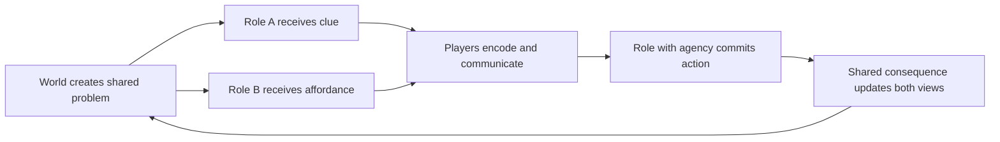

# Worldview Game — Asymmetric Information Cooperation

Build a horror encounter in which players survive by combining different, incomplete views of the same danger. One player can perceive a rule another cannot; another can act where the first cannot; communication turns those partial truths into a shared decision.

> **The result gives every role necessary agency, a clear shared vocabulary, and a diagnosable mistake-and-recovery path.**

## Call this Skill

```text
/worldview-game-asymmetric-information-cooperation

Build a two-player encounter in my bell tower. The player below can rotate the
counterweights but cannot see which ropes are marked by the night creature. The
player above can see the marks through a viewing lens but cannot touch the gears.
They must communicate three safe moves before the creature reaches either room.
```

## When to use it

Use this Skill for two or more players whose roles differ by perception, location, tool, language, time window, or authority. It supports online, local, mixed-device, or explicitly designed AI-partner play when the project already provides that environment.

Do not use it for ordinary co-op where everyone has the same information, a hidden-traitor game, a voice-chat-only puzzle with no accessible alternative, or a single-player companion that solves the puzzle automatically.

## What you provide

- the supported player count, devices, session type, and join flow;
- each role's location, perception, tool, and allowed action;
- the shared objective, pressure source, and intended failure;
- available voice, text, ping, symbol, caption, and input channels;
- reconnect, late-join, solo, privacy, and moderation requirements that already exist.

## What you receive

```text
gameplay/<encounter-slug>/
├── mechanic.md       roles, information ownership, vocabulary and state loop
├── tunables.yaml     timing, channel, threat, retry and assistance values
└── verification.md   role, network, accessibility, failure and reset evidence
```

When the runtime is available, the Skill implements one complete cooperative loop, records entry and joining instructions, and tests it from every role.

## How the Skill proceeds

The Agent fixes eight decisions in order: the shared outcome, role agency, information boundary, shared vocabulary, commit protocol, pressure and recovery, session authority, and cross-role proof. Puzzle content begins after the first five agree. A later role, clue, channel, or acceptance change reopens the affected decision and invalidates the old timing and network evidence.

## The cooperation loop



## Source and method

This is an original Worldview Skills method. Its roles, contracts, example, and verification structure are not copied from an external Skill or named game.

[Read the source record](SOURCE.md) · [Read why the mechanic works](references/why-this-mechanic-works.md) · [Fill the mechanic contract](templates/mechanic-contract.md) · [See the original example](examples/the-bellhouse-interval.md)
