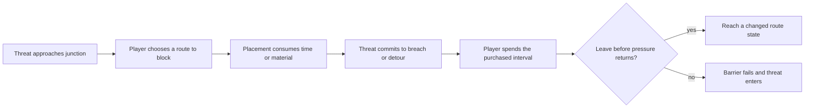

# Worldview Game — Barricade Delay and Route Choice

Turn doors, furniture, shutters, and improvised obstacles into a playable decision about time. A barricade does not erase a threat. It changes which route remains open, how long the player has, and what will be unavailable when they return.

> **The result is a playable spatial exchange.** Blocking one approach must create a measurable delay and a meaningful route consequence.

## Call this Skill

```text
/worldview-game-barricade-delay-and-route-choice

Use the clinic floor already in my project. Let the player push a medicine cart
against one stairwell door while the creature climbs from below. The cart should
buy enough time to search one treatment room, but it must close the fastest route
back to the lobby and eventually be breached.
```

## When to use it

Use this Skill when the player should trade access, material, noise, or future mobility for a temporary interval of safety. It works for a single authored room, a pursuit junction, a defense beat, or a recurring family of barriers.

Do not use it for a permanently locked progression door, decorative furniture, a base-building system, or a cinematic in which the player never chooses what to block. Those require different contracts.

## What you provide

- the existing project or a map of the relevant junction;
- the threat's routes, speed, reach, and breach behavior;
- objects or resources that could form a barrier;
- the actions the player hopes to complete during the delay;
- world rules that determine what can plausibly be moved, broken, or repaired.

## What you receive

```text
gameplay/<encounter-slug>/
├── mechanic.md       barrier states, player verbs, routes and consequences
├── tunables.yaml     placement, integrity, breach, noise and recovery values
└── verification.md   timing traces, route tests, failures and restart checks
```

When a runnable project exists, the result also includes the implemented interaction, a playable entry point, controls, and a screenshot from the running scene. A screenshot proves presentation only; the timing and route claims require direct behavioral evidence.

## How the Skill proceeds

The Agent fixes six decisions in order: the delay exchange, the route mutation, the placement transaction, the threat response, the useful interval, and lifecycle proof. Implementation begins only after the route and placement agree about the same physical edge. Timing begins after the threat response is stable. A later map, physics, or accessibility change reopens the affected decision and invalidates its old traces.

## The decision loop



The central quantity is not barrier health by itself. It is the useful interval between the player's commitment and renewed threat contact, after placement time, travel, noise, and the blocked return route are counted.

## Source and method

This is an original Worldview Skills method written for the horror-mechanics collection. It does not reproduce an external Skill, named game's encounter, level, terminology, or tuning table.

[Read the source record](SOURCE.md) · [Read why the mechanic works](references/why-this-mechanic-works.md) · [Fill the mechanic contract](templates/mechanic-contract.md) · [See the original example](examples/the-north-stair-cart.md)
