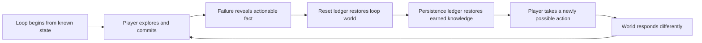

# Worldview Game — Death Loop and Persistent Clues

Build a horror loop in which death resets the dangerous situation but preserves carefully chosen knowledge, marks, relationships, or world changes. Repetition becomes investigation: the player uses what survived to reach a meaningfully different decision next time.

> **This Skill never destroys real user saves.** “Death loop” describes an authored game-state transition, not deletion, fake corruption, or punishment outside the fiction.

## Call this Skill

```text
/worldview-game-death-loop-persistent-clues

Use my tide observatory. Every death returns the player to 4:13 before the flood,
but hand-written chart marks and remembered signal phrases persist. Build one loop
where the first death teaches when the lower door seals and the second run lets the
player redirect the beacon before entering that corridor.
```

## When to use it

Use this Skill when repeating a bounded interval should convert failure into actionable knowledge. It works for temporal loops, ritual recurrence, inherited memory, repeated dreams, simulation resets, or other fictional causes with explicit state rules.

Do not use it for ordinary checkpoint respawn, procedural runs driven mainly by randomized loot, destructive save tricks, or repetition that changes nothing except requiring the same actions again.

## What you provide

- the current project and its save, checkpoint, death, quest, inventory, and clock owners;
- the fictional entry moment, reset triggers, and exit condition;
- the fields that should reset, persist, transform, or stay outside the recurrence;
- one first-pass observation and the later action it should change;
- quit/resume, new-game, replay, accessibility, and network requirements.

## What you receive

```text
gameplay/<loop-slug>/
├── mechanic.md       loop boundary, reset/persist ledger and clue dependencies
├── tunables.yaml     timing, reveal, replay and assistance values
└── verification.md   reset, persistence, sequence and data-safety evidence
```

When a runnable project exists, the Skill implements the smallest complete two-pass loop and verifies it across death, reload, quit/resume, and full new-game boundaries.

## How the Skill proceeds

The Agent fixes seven decisions in order: the loop promise, loop boundary, state ledger, clue dependency, schedule and replay rules, storage transaction, and multi-pass proof. Reset code begins after the boundary and ledger agree. Clue content begins after the promise and dependency agree. A later schedule, state-owner, or save change reopens the affected decision and invalidates its old pass traces and snapshots.

## The learning loop



## Source and method

This is an original Worldview Skills method. It does not copy an external Skill or a named game's loop, save behavior, story, or progression structure.

[Read the source record](SOURCE.md) · [Read why the mechanic works](references/why-this-mechanic-works.md) · [Fill the mechanic contract](templates/mechanic-contract.md) · [See the original example](examples/four-thirteen-at-low-water.md)
