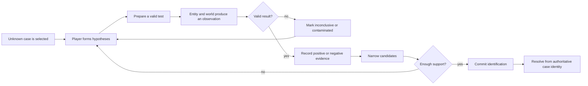

# Worldview Game — Evidence-Based Entity Identification

Build a playable investigation in which the player tests an unknown danger, compares claims with observed behavior and physical or institutional traces, distinguishes valid findings from inconclusive or contaminated readings, and commits to an operational conclusion that changes what they do next.

> **This Skill builds an investigation, not a collectible checklist.** Evidence retains who claimed, witnessed, held, or inspected it; behavior may be helpful in one context and harmful in another; and the final identification reads the same authoritative case state that generated the clues.

## Call this Skill

```text
/worldview-game-evidence-based-entity-identification

Use the existing conservatory map and roaming entity. Give the player three
field instruments and a shared notebook. Each instrument should require a real
test condition, the entity should be identifiable from a consistent evidence
combination, and danger should force the player to decide when to observe and
when to retreat. Verify every candidate matrix row, one wrong conclusion, and reset.
```

The Slash name is the stable public entry. The user may provide an existing project and entity system, a candidate taxonomy, a location and desired tests, or only the investigation premise. The Agent first recovers the project’s facts and separates them from newly proposed evidence rules.

## When to use it

Use this Skill when the main play is a cycle of hypothesis and test, including cases where the unknown may be a creature, person, institution, environmental condition, or mixed cause:

1. Several candidate identities could explain the initial signs.
2. Tools, environmental manipulations, or close observation can produce discriminating evidence.
3. Results may be positive, validly negative, inconclusive, or contaminated.
4. The player records and interprets findings while danger constrains observation.
5. A final commitment is checked against the same authoritative case state.
6. Testimony, access records, payments, schedules, keys, or physical residue may matter alongside instrument readings.

Do not use it for lore trivia, a linear clue trail with only one selectable answer, arbitrary item collection, a dialogue-only mystery, or a general quest journal. Do not use it when the identity is merely revealed in a cutscene regardless of what the player tested.

## What you provide

Useful inputs include:

- the authorized game project and playable entry;
- existing entity states, candidate types, encounter selection, and threat behavior;
- the map, investigation zones, retreat routes, and environmental controls;
- current tools, interactions, UI, journal, audio, and accessibility conventions;
- desired evidence families and world rules governing when they can appear;
- single-player or multiplayer ownership and supported platforms.

The Agent can propose a compact candidate matrix when none exists, but labels every new candidate, evidence rule, and test condition as a proposal until implemented and verified.

## What you receive

```text
gameplay/<case-slug>/
├── mechanic.md       candidate matrix, test protocols, ledger and decision rules
├── tunables.yaml     windows, ranges, rates, pressure and feedback values
└── verification.md   solvability, observation, failure, restart and authority evidence
```

Implementation stays in the project’s established source tree. The handoff also identifies the playable entry, controls, chosen case or seed, reused assets, successful and failed reasoning traces, and limitations.

## How the Skill proceeds

The Agent fixes four dependent layers before implementation:

1. **Candidate Matrix Lock:** candidate IDs, evidence capabilities, case selection, and a proof that every case is distinguishable.
2. **Test Protocol Lock:** valid opportunities, result classes, contamination, retreat, retry, and equivalent cues.
3. **Evidence Ledger Lock:** accepted event provenance, authority, duplicate handling, and the notebook’s information boundary.
4. **Identification Outcome Lock:** submission threshold, correct and wrong consequences, anti-brute-force recovery, and the final world action.

A changed candidate, protocol, ledger, or consequence reopens the earliest affected layer. Dependent tests and reasoning traces are invalid until rerun.

## The investigation loop



The notebook may help organize evidence, but it must not invent facts the player did not obtain. Interpretation remains connected to observable tests.

## Read the method

[Read the full Agent method](SKILL.md) · [See the contract template](templates/mechanic-contract.md) · [Read why the mechanic works](references/why-this-mechanic-works.md) · [Open the original fictional example](examples/wrenfall-conservatory.md) · [Review source provenance](SOURCE.md)
