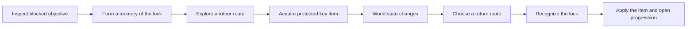

# Worldview Game — Key-Item Backtracking

Build a playable return journey in which acquiring a protected object changes what an already known space means. The player reads a lock, remembers a route, obtains the matching capability, and comes back through a world that has changed in understandable ways.

> **This Skill designs a return with new decisions.** It does not stretch playtime by making the player walk the same empty corridor twice.

## Call this Skill

```text
/worldview-game-key-item-backtracking

Use the existing archive floor. Let the player inspect the stalled freight lift,
find its counterweight spindle in the catalog annex, then return through a newly
opened maintenance stair after emergency shutters close the public gallery.
Preserve the key item and prove every save state can still reach the lift.
```

The text after the Slash command may identify the lock, key item, route, world change, and intended emotional beat. The Agent recovers the actual project graph before proposing gates or moving content.

## When to use it

Use this Skill when the desired play depends on five connected events:

1. the player encounters and can later recognize a blocked objective;
2. the missing object or capability has a readable relationship to that block;
3. obtaining it updates persistent progression state;
4. the return route changes knowledge, access, risk, or traversal; and
5. the player can recover from detours without losing the required object or becoming trapped.

It works for compact horror maps, survival routes, mystery spaces, and other games where spatial memory matters. Do not use it for a linear fetch quest with automatic fast travel, an abstract quest log with no navigable return, a combination puzzle whose answer—not traversal—is the mechanic, or a random lock-and-loot system.

## What you provide

The Skill can begin with a running project, a level scene, a graph or floor plan, or a short description. Useful material includes:

- the target lock, its current feedback, and the progression state it controls;
- existing key items, objective state, doors, shortcuts, navigation, and saves;
- the first route to the item and candidate return routes;
- threats, environmental changes, and story facts that may recontextualize known rooms;
- accessibility, input, and multiplayer requirements.

The Agent records what the project declares, what was observed in the runtime, and what remains a proposal. It does not assume that a door visible in a scene has functioning collision, persistence, or navigation.

## What you receive

```text
gameplay/<return-route-slug>/
├── mechanic.md       gate, key, route-state and feedback contract
├── route-states.md   reachable graph before and after each progression change
├── tunables.yaml     interaction, traversal, threat and reminder values
└── verification.md   recognition, return, softlock, save and restart evidence
```

When the current runtime is available, the implementation stays in its established source tree. Delivery includes a playable entry point, controls, one screenshot from the actual route, and evidence for the intended return, at least one wrong-turn recovery, save/load at progression boundaries, and any multiplayer behavior claimed.

## How the Skill proceeds

The Agent fixes the **Progression Relationship Lock** first, then makes every S0–S3 edge and named safe anchor agree in the **State-Aligned Route Lock**. The **Return Transformation Lock** records what visibly changes and what remains reliable; the **Atomic Application Lock** converts key ownership from protected storage to the installed gate socket in the same commit that unlocks progression; the **Navigation Pressure Lock** fixes the timing, cues, recovery cost, and assists to test. Implementation begins after those records are fixed. A later contradiction reopens the earliest affected lock and invalidates every dependent graph and trace.

## The route loop



The return should be shorter, stranger, riskier, more informative, or tactically different. It does not need constant surprise, but it must justify revisiting space with more than elapsed distance.

## Read the complete method

[Agent instructions](SKILL.md) · [Mechanic contract](templates/mechanic-contract.md) · [Original-source record](SOURCE.md) · [Why the mechanic works](references/why-this-mechanic-works.md) · [Example: The Rain Archive](examples/rain-archive-return.md)
