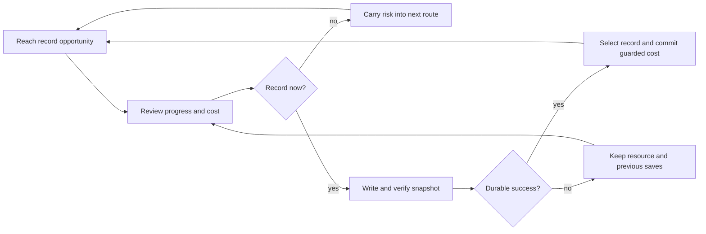

# Worldview Game — Limited-Save Risk

Build a saving system in which choosing when to create a durable manual record becomes part of survival planning. Scarce save opportunities may create tension, but recovery safeguards, clear costs, accessibility overrides, and crash-safe writes protect the player's time and data.

> **This Skill limits an in-world opportunity, not the safety of the user's files.** It never treats corrupted, erased, or silently overwritten saves as acceptable difficulty.

## Call this Skill

```text
/worldview-game-limited-save-risk

Add limited manual recording to the existing observatory route. Use the three
record desks and a scarce record-seal resource, but keep a separate recovery
checkpoint for crashes and accessibility. Show the cost before confirmation,
charge only after a verified write, and never delete or silently overwrite a save.
```

The brief may describe a project, save stations, route length, desired tension, and accessibility policy. The Agent first audits the existing persistence system because save safety cannot be designed from interface mockups alone.

## When to use it

Use this Skill when the player should make an informed decision about committing progress now or carrying a save opportunity farther into an uncertain route. A suitable project has:

1. reliable persistence infrastructure that can be tested independently of scarcity;
2. meaningful travel, resources, or world changes between recording opportunities;
3. clear manual-record costs and locations;
4. a separate recovery path for crashes, interruptions, and accessibility needs; and
5. an explicit promise that existing records will not be silently overwritten or destroyed.

Do not use it to compensate for unstable software, inflate playtime through repeated unskippable content, delete saves after failure, enforce permadeath, or prevent players from exiting safely. Those are different—and materially riskier—contracts.

## What you provide

Useful inputs include:

- the current save schema, slot UI, checkpoint behavior, and profile storage;
- route graph, safe rooms or terminals, expected intervals, and irreversible transitions;
- the proposed scarce recording resource and how players forecast its supply;
- platform lifecycle requirements and storage limits;
- accessibility, shared-device, cloud-sync, and multiplayer constraints.

Do not provide secrets or production player data. A copy of a test profile or documented schema is sufficient. The Agent distinguishes observed durability from proposed scarcity.

## What you receive

```text
gameplay/<save-loop-slug>/
├── mechanic.md          player-facing record rules and route relationship
├── persistence-plan.md  snapshot, transaction, backup and migration contract
├── tunables.yaml        costs, placements, reminders and recovery settings
└── verification.md      fault, load, accessibility and gameplay evidence
```

When implementation is possible, the project receives a working manual-save loop plus separate recovery behavior, test profiles, and evidence from interrupted writes and load verification. If storage durability cannot be proven in the current environment, the Agent stops short of calling it safe or complete.

## How the Skill proceeds

The Agent first fixes the **Recovery Baseline Lock**, then the **Snapshot Boundary Lock** and the exact **Durable Publication Lock**. That publication lock gives standard, zero-cost, and unrestricted modes the same verified write, durable-version selection, retry, and guarded resource-commit boundary. It also forbids copying an older snapshot over unrelated live play that advanced after capture. Scarcity is considered only after those safety layers hold. The **Recording Route Lock** then defines the meaningful save-timing choices, and the **Access and Authority Lock** fixes assists, safe exit, input, and shared ownership. Implementation stops if a safety lock cannot be proven; a later contradiction reopens the earliest affected lock and invalidates dependent fault evidence.

## The player-facing loop



The scarce resource belongs to the choice. Crash recovery, safe exit, data migration, and accessibility overrides belong to player protection and must not be withheld to intensify the fiction.

## Read the complete method

[Agent instructions](SKILL.md) · [Mechanic contract](templates/mechanic-contract.md) · [Original-source record](SOURCE.md) · [Why the mechanic works](references/why-this-mechanic-works.md) · [Example: The Closed Observatory](examples/closed-observatory-record.md)
