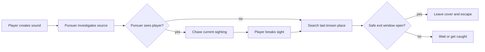

# Worldview Game — Lure, Hide, Escape

Build a playable pursuit in which the player changes what the pursuer knows, hides inside a real map, waits for the pursuer to commit to the wrong place, and leaves through a second route.

> **This Skill produces gameplay, not a chase video.** The encounter succeeds only when perception, navigation, timing, collision, failure, and restart work in the project's actual runtime.

## Call this Skill

```text
/worldview-game-lure-hide-escape

Use my hotel floor and existing creature. Let the player throw a reusable noise
lure, hide beneath the bed, watch the creature inspect the far side of the room,
then leave through the second door. Build this in the current game project.
```

The Slash name is the stable public entry. The text after it supplies the world, map, pursuer, and desired escape beat without asking the user to translate their idea into engine parameters.

## When to use it

Use this Skill when the desired experience depends on all four of these relationships:

1. The player can create or reveal a false point of interest.
2. The pursuer acts on what it saw or heard, not on the player's hidden live position.
3. A hiding place changes the player's options but does not grant unconditional invisibility.
4. The map creates a measurable interval in which leaving cover can succeed or fail.

That pattern works in horror, stealth, heists, creature encounters, and exploration. Horror is one presentation of the rule, not the rule itself.

Do not use it for a linear chase with no hiding decision, a cutscene that only depicts pursuit, a universal stealth system for arbitrary levels, or an enemy that is supposed to know the player's position supernaturally. Those are different contracts.

## What you provide

The Skill can begin with a complete game project, a grey-box map, a room sketch, or a short description. Existing project files take priority over invented replacements. Useful material includes:

- the current engine and input conventions;
- the map, collision, navigation, and named exits;
- the pursuer model, animation, sound, and perception rules;
- the intended lure and hiding place;
- any world facts that change what the pursuer can perceive or do.

When one essential ambiguity would produce incompatible encounters, the Agent asks one grouped question. It does not ask the user to choose pathfinding algorithms, arbitrary success percentages, or timer values that can be derived from the map.

## What you receive

```text
gameplay/<encounter-slug>/
├── mechanic.md       player verbs, state machine, knowledge rules and map contract
├── tunables.yaml     measured speeds, ranges, timers and interruption rules
└── verification.md   success, failure, restart, boundary checks and limitations
```

The working implementation stays in the project's established source tree. The delivery also includes a playable entry point, controls, one screenshot from the running scene, and the exact checks that were performed. If the project has no runnable engine, the Skill stops at an implementation-ready contract and says what remains unverified.

## How the Skill proceeds

The Agent fixes seven decisions in order: the encounter promise, shared room, pursuer evidence, lure event, cover transition, measured escape margin, and reset proof. Code begins after the first five agree. Timing begins after the route and transitions are stable. A later map or perception change reopens the affected decision and invalidates its dependent traces instead of being hidden inside retuning.

## The playable loop



The important boundary is between what the simulation knows and what the pursuer is allowed to know. The renderer always knows where every object is. The pursuer may act only on a sighting, a sound origin, or a remembered last-known position declared by the mechanic.

## Source and evidence

This rewrite comes from the user-supplied `mechanics-pack-2026-09-11.tar.gz`. Its original `lure-hide-escape` Skill contained the core state and map rules in one 33-line file. The same package includes the playable **Last Footstep** encounter and a verification report for the shared Mechanics Lab.

[Read the transformation record](SOURCE.md) · [Read why the mechanic works](references/why-this-mechanic-works.md) · [Fill the mechanic contract](templates/mechanic-contract.md) · [See the recorded example](examples/last-footstep.md)
