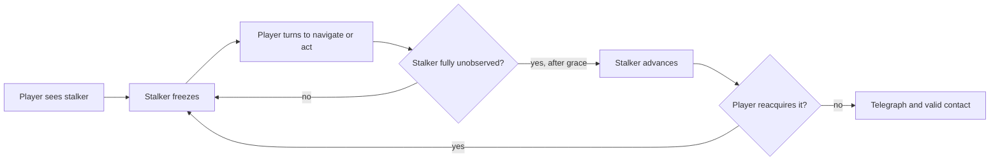

# Worldview Game — Observation-Gated Stalker

Build a playable encounter in which watching a stalker restrains it and looking elsewhere gives it permission to advance. The result is not merely an enemy that checks the camera's forward direction. It is a complete attention trade: the player must surrender information about the route in order to hold the threat in place.

> **This Skill builds a verified gameplay rule.** A frightening model, a camera-facing dot product, or a scripted teleport does not prove that the rule is fair.

## Call this Skill

```text
/worldview-game-observation-gated-stalker

Use the observatory map in my current project. The brass attendant must remain
still while any visible part of it is on screen, advance while pillars fully
hide it, and stop before contact if the player catches it in view again. Give
the player a lens to retrieve and an exit that forces two backward glances.
```

The text after the Slash command may name an existing project, a rough map, a desired creature, or only the attention-based encounter. The Agent recovers the project's actual camera, collision, navigation, and input rules before choosing implementation details.

## When to use it

Use this Skill when the central decision is **where the player spends visual attention**. It fits horror, surreal exploration, spatial puzzles, stealth, and any encounter in which watching one place means temporarily neglecting another.

The request is a good match when it needs most of these relationships:

1. The stalker is restrained by genuine visibility, not merely by distance.
2. Walls and other declared occluders can release it even while the camera points toward it.
3. Looking backward protects the player but makes navigation or objective work harder.
4. Reacquiring the stalker creates an immediate, readable change in behavior.
5. Success and failure can be produced by player attention rather than a hidden random roll.

Do not use this Skill for an ordinary chase, an enemy that freezes according to a timer, a cinematic cut, a still-image scare, or a universal perception framework for every enemy in a large game. Do not use it when the fiction requires the stalker to move while visibly observed; that is a different rule and should be stated honestly.

## What you provide

Any of the following is enough to begin:

- the authorized path to an existing game project;
- a level, collision map, screenshot, blockout, or verbal route;
- the current player controller and camera behavior;
- an existing enemy asset or permission to use labeled proxy geometry;
- a required objective, exit, difficulty target, or accessibility constraint;
- world facts that define what “observation” means in the fiction.

You do not need to specify frustum math, sampling density, grace periods, or attack timing. Those become measured proposals, recorded as tunables and verified in the actual runtime.

## What you receive

```text
gameplay/<encounter-slug>/
├── mechanic.md       observation rule, state transitions and spatial contract
├── tunables.yaml     visibility, grace, speed, reach and objective values
└── verification.md   successful route, failures, boundary tests and limitations
```

The implementation remains in the project's established source tree. The handoff identifies the runnable scene, controls, reused assets, one captured frame from the running encounter, and behavioral evidence for the claims. If no runtime can be executed, the delivery stops at an implementation-ready contract and labels every untested assumption.

## How the Skill proceeds

The Agent fixes five dependent decisions before implementation: who and what counts as observation, which simulation step grants movement and contact, where the route forces attention away, what timing separates a save from a hit, and who owns the rule and its evidence. These become the **Observer and occlusion lock**, **Permission-order lock**, **Attention-route lock**, **Contact-timing lock**, and **Authority-and-evidence lock**. If a later engine fact contradicts one, the Agent reopens that lock and repeats every dependent check instead of patching around it.

## The playable relationship



The decisive question is not whether the stalker is in front of the player. It is whether the declared observation test succeeds **before movement and harm are resolved on the same simulation step**.

## Read the complete method

[Agent instructions](SKILL.md) · [Mechanic contract template](templates/mechanic-contract.md) · [Source record](SOURCE.md) · [Why the mechanic works](references/why-this-mechanic-works.md) · [Original example](examples/the-lantern-index.md)
