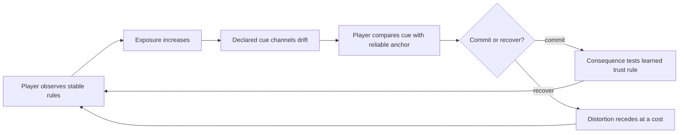

# Worldview Game — Perception Distortion and Trust

Build a horror mechanic in which presentation becomes unreliable while the underlying game remains fair. The player learns which signals can drift, which anchors remain trustworthy, and how to act before certainty returns.

> **The mechanic separates authoritative world state from subjective presentation.** Its fiction uses a named cause and never treats real mental illness as shorthand for monstrosity or moral failure.

## Call this Skill

```text
/worldview-game-perception-distortion-and-trust

In my flooded archive, prolonged exposure to the singing pipes should make room
labels, reflections, and distant footsteps unreliable. The brass survey compass
must remain truthful so the player can still navigate. Build one escalating route
with a recovery action and a failure caused by trusting the wrong signal.
```

## When to use it

Use this Skill when horror should come from deciding which perceptions deserve trust. It works for supernatural influence, hostile signals, memory contamination, dream logic, toxic exposure, or an explicitly fictional condition with its own world rules.

Do not use it to represent a real diagnosis, to randomize controls without warning, to conceal required information with no recovery path, or to add cosmetic screen effects that never change a decision.

## What you provide

- the current level or a route sketch;
- the fictional cause and the cue channels it may affect;
- the world facts and system UI that must remain authoritative;
- at least one anchor, recovery action, and consequential trust decision;
- motion, flash, audio, text, input, and content constraints.

## What you receive

```text
gameplay/<encounter-slug>/
├── mechanic.md       truth layer, distortion channels, anchors and recovery
├── tunables.yaml     exposure, escalation, cue selection and assistance values
└── verification.md   fairness, accessibility, persistence and restart evidence
```

When a runtime is available, the Skill also implements the smallest complete encounter, records a playable entry point, and captures presentation evidence alongside behavioral tests.

## How the Skill proceeds

The Agent fixes six decisions in order: world truth, distortion scope, reliable anchors, the false-cue grammar, recovery and comfort limits, and reproduction proof. Effects begin only after the first five agree, including the recovery and comfort boundary. A later route, channel, anchor, recovery, or accessibility change reopens the affected decision and invalidates its old save cases, traces, and captures.

## The trust loop



The mechanic remains fair because the simulation never silently changes every source of truth at once. Distortion has a cause, a readable scope, and at least one dependable way to reason through it.

## Source and method

This is an original Worldview Skills method. It does not reproduce an external Skill or a named game's meter, effects, fiction, or encounter.

[Read the source record](SOURCE.md) · [Read why the mechanic works](references/why-this-mechanic-works.md) · [Fill the mechanic contract](templates/mechanic-contract.md) · [See the original example](examples/the-brass-north.md)
