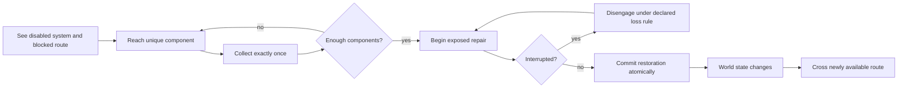

# Worldview Game — Restore Power Under Pressure

Build a playable objective in which the player must locate distinct components, return to a disabled system, complete an interruptible repair, and use the restored state to open a real route while danger changes how each trip is planned.

> **This Skill builds a causal objective, not a decorative blackout.** Components are unique, collection is persistent, repair has a legible interruption rule, restored power changes authoritative game state, and the newly available route can actually be completed.

## Call this Skill

```text
/worldview-game-restore-power-under-pressure

Use the maintenance level already in my project. The player must recover three
distinct relay pieces while the roaming threat makes each return more dangerous,
repair the distribution board, and escape through the powered freight door.
Keep the current player controller and enemy. I need a playable success, at least
one interruption failure, a clean restart, and evidence of what was tested.
```

The Slash name is the stable public entry. The text after it may describe a project, a map, a story constraint, or only the intended objective. The Agent recovers the missing implementation facts from the authorized project before proposing replacements.

## When to use it

Use this Skill when restoring a disabled system is the main dependency chain:

1. The player sees a meaningful locked consequence before or during the search.
2. Several unique components must be reached and collected exactly once.
3. Returning to the repair point creates risk rather than clerical backtracking.
4. Repair can be interrupted under a declared rule.
5. Completed repair latches a persistent world change and enables a real route.

The danger may be a pursuer, an environmental cycle, limited safe light, rising contamination, or another implemented pressure source. Horror is a strong presentation for the mechanic, but the dependency chain—not darkness—is what this Skill builds.

Do not use it for a single switch with no search, a cinematic power-on moment, an inventory system for an entire game, or a generic quest-writing request. Do not use it when power restoration is only incidental to a larger mechanic and does not need its own state, verification, and failure paths.

## What you provide

Useful inputs include:

- the authorized game project and playable entry point;
- the disabled device, blocked route, component locations, and existing interaction system;
- the current threat or environmental pressure;
- world rules governing electricity, machinery, light, doors, and inventory;
- intended controls, supported platforms, and multiplayer expectations;
- one desired dramatic beat, such as the threat crossing the return corridor while repair progress is exposed.

An existing project does not need to use the words “component,” “panel,” or “power.” The same contract can govern ritual seals, pressure valves, signal relays, or other world-specific parts when the causal structure remains intact.

## What you receive

```text
gameplay/<objective-slug>/
├── mechanic.md       dependency graph, interactions, state and interruption rules
├── tunables.yaml     reach, timings, quantities, pressure and feedback values
└── verification.md   success, failure, restart and boundary evidence
```

The implementation stays in the project’s established source tree. The handoff also names the playable entry, controls, reused assets, one screenshot from the running objective, and the exact tests or playthroughs performed. If the current environment cannot run the project, the result is labeled an implementation-ready contract rather than playable work.

## How the Skill proceeds

The Agent fixes four dependent layers before implementation:

1. **Dependency Route Lock:** the blocked consequence, component IDs, routes, repair point, and destination.
2. **Objective State Lock:** collection ownership, repair interruption, atomic restoration, persistence, and restart.
3. **Pressure Window Lock:** the warning, recovery path, successful repair interval, and nearby failure.
4. **Restoration Consequence Lock:** every system that reads restored state and the action that proves the route works.

Later tuning cannot silently change an earlier lock. A map, ownership, timing, or subscriber change reopens the earliest affected layer and invalidates its dependent tests before implementation continues.

## The objective loop



The key boundary is between presentation and authoritative state. Flickering lights can communicate danger, but they do not decide whether a component exists, whether repair completed, or whether the exit is unlocked.

## Read the method

[Read the full Agent method](SKILL.md) · [See the contract template](templates/mechanic-contract.md) · [Read why the mechanic works](references/why-this-mechanic-works.md) · [Open the original fictional example](examples/ashwater-substation.md) · [Review source provenance](SOURCE.md)
