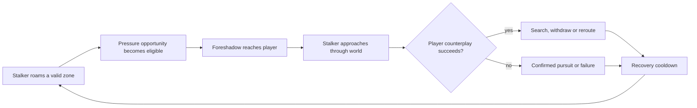

# Worldview Game — Roaming Stalker Pressure

Build a persistent threat whose territory can be predicted before first sight, whose location and search follow declared evidence, and whose release, withdrawal, capture recovery, and return remain readable across connected objectives.

> **This Skill builds sustained pressure from spatial continuity.** Local claims about the stalker remain separate from observed behavior, and a pressure episode ends only through a declared release condition—not because a hidden timer silently expires.

## Call this Skill

```text
/worldview-game-roaming-stalker-pressure

Use the three connected wings of my weather station. One ash-covered surveyor
should physically roam between them, react to completed instruments and noisy
shortcuts, and create short pressure encounters without appearing in the room
the player just checked. Give the player readable traces, route counterplay,
cooldowns, and a complete three-objective route with restart.
```

The brief may name an existing world, threat, objective sequence, or desired pressure curve. The Agent recovers streaming, navigation, doors, encounters, saves, and current AI before proposing a roaming architecture.

## When to use it

Use this Skill when a horror game needs one threat—or a very small identified set—to remain relevant across several spaces and objectives. It is a good match when:

- the player revisits or chooses among connected zones;
- uncertainty about the stalker's location matters, but outcomes must remain explainable;
- objective progress, noise, route use, or time can create pressure opportunities;
- the stalker should foreshadow, approach, confront, search, and withdraw rather than attack continuously;
- hiding, locking, rerouting, observing traces, or spending a resource can alter the encounter;
- saving, loading, streaming, and restart must preserve one coherent stalker identity.

Do not use it for a single-room chase, a fixed patrol guard, a scripted sequence with no systemic variation, a horde director, or unbounded random jump scares. If the enemy should always know and sprint directly to the player, use a pursuit mechanic instead.

## What you provide

Useful inputs include:

- an authorized project and its connected maps or zone graph;
- the player controller, objectives, doors, hiding, sound, combat, or avoidance systems already present;
- one stalker asset and current navigation or behavior;
- world streaming, spawn, save, and checkpoint rules;
- desired difficulty, session length, accessibility, and multiplayer mode;
- fiction that defines how the stalker travels and what signs it leaves.

The Agent does not require a target number of random encounters. It proposes pressure opportunities from the actual route, then verifies the minimum warning and recovery periods.

## What you receive

```text
gameplay/<stalker-slug>/
├── mechanic.md       identity, zone, pressure, encounter and fairness contract
├── tunables.yaml     budgets, cooldowns, distances, warning and search values
└── verification.md   continuity, counterplay, save/load and route evidence
```

When a runtime exists, the package produces a working bounded route in the current project, with controls, one captured frame, temporal traces, success, failures, and restart. If runtime or required systems are missing, it stops at a clearly labeled implementation or contract state.

## How the Skill proceeds

Before implementation, the Agent fixes the shared world route and single identity, the evidence the stalker may know, the exact pressure-eligibility predicate, each legal warning and encounter, and persistence/authority across streaming and restart. These become the **World-route-and-identity lock**, **Stalker-knowledge lock**, **Pressure-eligibility lock**, **Encounter-and-warning lock**, and **Persistence-and-authority lock**. A later streaming, sensing, threshold, encounter, or save change reopens the earliest affected lock and invalidates its dependent traces.

## The pressure rhythm



The director may decide **when an opportunity is eligible**. It may not invent impossible knowledge, ignore the map, or remove the player's final counterplay.

## Read the complete method

[Agent instructions](SKILL.md) · [Mechanic contract template](templates/mechanic-contract.md) · [Source record](SOURCE.md) · [Why the mechanic works](references/why-this-mechanic-works.md) · [Original example](examples/the-ash-cartographer.md)
