# Worldview Game — Safe-Room Pressure Reset

Build a playable refuge that gives the player a reliable break from immediate pursuit while preserving the larger horror campaign. The room can support saving, planning, inventory work, limited recovery, story, or route choice, but its first responsibility is to make the transition from danger to temporary control legible and trustworthy.

> **A safe room is a state contract, not a sign on a door.** Entry, threat disengagement, recovery, saving, exit, re-entry, and restart must agree about what “safe” means.

## Call this Skill

```text
/worldview-game-safe-room-pressure-reset

Turn the decontamination booth in my mine level into a dependable refuge. The
burrower must stop pursuit at the sealed threshold, but remain somewhere in the
outer tunnel rather than vanish. Let the player save, restore one lamp charge,
inspect the next route, and leave without the burrower waiting directly outside.
```

The brief may provide an existing level, a candidate room, a pursuing threat, resource rules, or only the desired feeling of relief. The Agent recovers project state and distinguishes the pressures the room should clear from those that should persist.

## When to use it

Use this Skill when a horror or survival game needs a bounded place where the player can recover agency between dangerous excursions. It is appropriate when the room must do several of these things together:

- end or suspend immediate pursuit through a visible world rule;
- clear unstable combat or detection state without corrupting the outer simulation;
- offer saving, checkpointing, inventory work, planning, or limited recovery;
- retain meaningful campaign consequences such as spent resources or completed objectives;
- provide enough exit information to make returning to danger a decision rather than a trap;
- support repeated entry without duplication, stale timers, or enemies camping the threshold.

Do not use it for a pause menu, an invulnerability cheat, a loading screen with no spatial meaning, a one-way checkpoint only, or a room that pretends to be safe before delivering an unavoidable scare. If betrayal of safety is essential, define a different explicit mechanic; do not undermine this contract invisibly.

## What you provide

Useful inputs include:

- the authorized project and candidate room or map region;
- player, threat, pursuit, door, save, inventory, and resource systems;
- what the room should allow: save, crafting, storage, healing, route preview, dialogue, or rest;
- which consequences must persist across entry, exit, death, and reload;
- accessibility and multiplayer requirements;
- world rules that justify why the threat cannot or will not cross.

The user does not need to invent an “anti-camping timer.” The Agent first asks what pressure should remain and uses objectives, bounded recovery, and a fair exit state instead of punishing the player for taking a promised rest.

## What you receive

```text
gameplay/<refuge-slug>/
├── mechanic.md       boundary, pressure, persistence and service contract
├── tunables.yaml     transition, recovery, re-entry and exit values
└── verification.md   pursuit, save/load, economy, exit and restart evidence
```

When the runtime is available, the implementation stays in the project's established source tree and includes a runnable route into and out of the refuge, controls, scene evidence, and verified state traces. When execution is unavailable, the delivery remains an implementation-ready contract with blockers named explicitly.

## How the Skill proceeds

Before implementation, the Agent fixes the exact protection boundary, the pressure ledger, each exterior threat's legal state, checkpoint-before-service order, and fair exit/re-entry. These become the **Refuge-boundary lock**, **Pressure-ledger lock**, **Exterior-threat lock**, **Checkpoint-and-service lock**, and **Exit-and-reentry lock**. Any later door, threat, save, service, or exit change reopens the earliest affected lock and invalidates the dependent traces.

## The pressure transition

```mermaid
flowchart LR
    A[Player reaches valid threshold] --> B[Entry commits atomically]
    B --> C[Immediate pursuit disengages]
    C --> D[Seal, pressure and exterior threat stabilize]
    D --> E[Baseline checkpoint result resolves]
    E --> F[Services permitted by that result become available]
    F --> G[Player plans and chooses exit]
    G --> H[Player returns with a fair information window]
```



Relief comes from converting unstable immediate danger into stable, inspectable choices. It does not require erasing every cost accumulated outside.

## Read the complete method

[Agent instructions](SKILL.md) · [Mechanic contract template](templates/mechanic-contract.md) · [Source record](SOURCE.md) · [Why the mechanic works](references/why-this-mechanic-works.md) · [Original example](examples/the-dryroom-bell.md)
