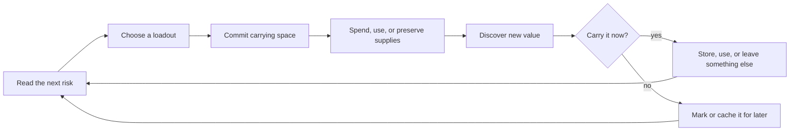

# Worldview Game — Scarce Inventory Triage

Build a survival inventory in which limited carrying space creates readable choices about what to keep, use, cache, or leave behind. The result is a playable resource loop with recoverable mistakes, not a cramped menu that deletes items or hides essential information.

> **This Skill turns scarcity into decisions.** It does not make an inventory interesting merely by shrinking its capacity.

## Call this Skill

```text
/worldview-game-scarce-inventory-triage

Use the existing clinic map and item database. Give the player a small field bag
that cannot carry every light source, treatment supply, tool, and defensive item.
Add a secure cache near the service lift, make every discard explicit, and prove
that the objective cannot be softlocked by a reasonable inventory choice.
```

The text after the Slash command may name an existing project, a playable route, the resources that should compete, and the kind of pressure the player should feel. The Agent derives implementation details from the project rather than asking the user to invent slot counts without evidence.

## When to use it

Use this Skill when carrying one useful thing must reduce the player's readiness for another plausible problem. It is a good fit when the project needs:

1. a small, inspectable inventory;
2. resources with different roles rather than one obviously dominant item;
3. safe points at which the player can reorganize or recover stored supplies;
4. visible consequences for preparation choices; and
5. protection against accidental deletion and progression softlocks.

Do not use it for a limitless collection screen, a crafting tree whose main challenge is recipe discovery, equipment loadouts chosen only before a match, or a user-interface reskin with no gameplay consequence. Those need different contracts.

## What you provide

The Skill can start from an existing project, an item spreadsheet, a route map, or a short encounter brief. Useful inputs include:

- current inventory, pickup, storage, equipment, and save behavior;
- item roles, stack rules, sizes, and scarcity targets already established by the project;
- mandatory keys or quest objects that must never be lost;
- expected route length and opportunities to return to a cache;
- target input devices, display sizes, and accessibility settings;
- multiplayer ownership rules if more than one player can move the same item.

Existing facts are recorded separately from proposals. If the project does not yet contain enough evidence to choose a capacity, the Agent builds the smallest test route and tunes against observed choices instead of presenting a guessed number as balanced.

## What you receive

```text
gameplay/<inventory-loop-slug>/
├── mechanic.md          inventory rules, item roles and decision model
├── tunables.yaml        capacities, stack sizes, costs and timing
├── resource-audit.md    required, optional and recoverable resources by route
└── verification.md      choice, overflow, softlock, restart and persistence checks
```

When a runtime is available, the delivery also includes the working implementation in the project's established source tree, a playable entry point, controls, and direct evidence for at least two materially different viable loadouts. If the project cannot run, the delivery stops at an implementation-ready contract and identifies every unverified claim.

## How the Skill proceeds

The Agent fixes five decisions in order: the **Route Pressure Lock** maps forecastable needs and return boundaries; the **Progression Protection Lock** identifies objects that cannot be put at risk; the **Item Competition Lock** defines the genuine tradeoffs; the **Capacity and Overflow Lock** makes fit and refusal behavior predictable; and the **Ownership and Recovery Lock** fixes staged durable acceptance plus the exact rollback-or-reconciliation result of an interrupted transfer. Implementation begins after those artifacts are fixed. A later contradiction reopens the earliest affected lock and invalidates its dependent evidence.

## The decision loop



Scarcity works only if the player can understand the trade. A decision may remain uncertain, but capacity, item function, replacement cost, and irreversible actions must be legible before confirmation.

## Read the complete method

[Agent instructions](SKILL.md) · [Mechanic contract](templates/mechanic-contract.md) · [Original-source record](SOURCE.md) · [Why the mechanic works](references/why-this-mechanic-works.md) · [Example: The Floodline Clinic](examples/floodline-clinic.md)
