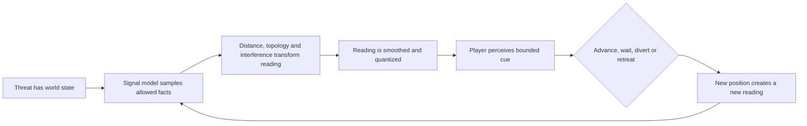

# Worldview Game — Signal Proximity Tracking

Build a playable tracking tool that translates a nearby threat into an incomplete but trustworthy signal: changing cadence, intensity, band, direction, or another world-specific response that helps the player decide whether to advance, wait, divert, or retreat.

> **This Skill builds bounded information, not a hidden minimap.** The detector exposes only the resolution promised by the mechanic, respects distance and occlusion, communicates interference honestly, and remains useful without revealing the threat’s exact live coordinates.

## Call this Skill

```text
/worldview-game-signal-proximity-tracking

Add a handheld induction meter to the existing underground relay map. Its pulse
should intensify as the unseen threat approaches through connected passages,
become uncertain near active transformers, and give the player enough warning
to choose a side room. Reuse the current threat and inventory systems. Verify a
successful reading, a misleading-but-fair interference case, failure, and reset.
```

The Slash name is the stable public entry. A user may provide a running project, a map and threat, or only the desired tracking experience. The Agent inspects the authorized project and states what is fact, what is proposed, and what has actually been tested.

## When to use it

Use this Skill when uncertainty about a nearby threat is itself playable:

1. The threat can be hidden by walls, darkness, distance, or limited attention.
2. The player has an instrument or sense that reports a bounded signal.
3. Changes in the signal support real route or timing decisions.
4. The signal has declared limits such as occlusion, noise, update delay, saturation, or interference.
5. Success and failure can both be traced to information the player could perceive.

The signal may be technological, biological, supernatural, environmental, or part of the player character’s perception. The mechanic remains the same when world truth is converted into a lower-resolution observation under stable rules.

Do not use it for a full minimap, an always-visible enemy marker, a scripted jump-scare warning, or a general enemy-AI framework. Do not use it when the signal is cosmetic and cannot affect a decision.

## What you provide

Useful material includes:

- the authorized project and playable entry;
- the map’s connected spaces, walls, doors, vertical layers, and safe alternatives;
- the current threat and its authoritative position or state;
- the intended detector, sense, UI, sound, animation, or controller feedback;
- world rules for what produces, blocks, distorts, or imitates the signal;
- supported inputs, displays, audio modes, and multiplayer expectations.

If a tool already exists, the Agent preserves its established visual language and ownership. If no map exists, the smallest valid prototype contains two routes, at least one occluding boundary, a place where signal bands change, a recoverable retreat, and one threat approach that can be read before contact.

## What you receive

```text
gameplay/<tracking-encounter-slug>/
├── mechanic.md       signal model, player decisions, map and threat integration
├── tunables.yaml     ranges, bands, smoothing, interference and cue values
└── verification.md   boundary, success, failure, reset and accessibility evidence
```

Implementation remains in the project’s normal source tree. The handoff identifies the playable entry, controls, source of truth, output cues, reused assets, direct evidence, and untested claims.

## How the Skill proceeds

The Agent fixes four dependent layers before implementation:

1. **Source Observation Lock:** eligible sources, authority, allowed samples, aggregation, and hidden facts.
2. **Spatial Propagation Lock:** the distance or topology model, walls, doors, floors, and bounded interference.
3. **Reading Vocabulary Lock:** stable bands, calibration, hysteresis, and equivalent player-facing cues.
4. **Response Window Lock:** the route decision, warning margin, successful response, and readable failure.

A source, map, band, or timing change reopens the earliest affected layer. Its dependent thresholds, cues, and playthrough evidence must be discarded and rerun before implementation continues.

## The information loop



The detector should be wrong only in ways the contract declares. Incomplete information creates tension; arbitrary contradiction destroys trust.

## Read the method

[Read the full Agent method](SKILL.md) · [See the contract template](templates/mechanic-contract.md) · [Read why the mechanic works](references/why-this-mechanic-works.md) · [Open the original fictional example](examples/cairnline-relay.md) · [Review source provenance](SOURCE.md)
