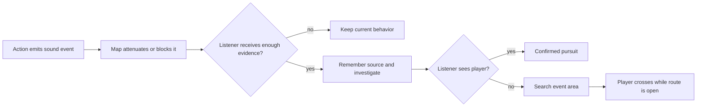

# Worldview Game — Sound Detection and Distraction

Build a playable horror-stealth encounter in which every sound keeps an immutable source, travels through the map, reaches intended and unintended listeners independently, and can redirect a threat, summon a witness, or expose the player to both at once.

> **This Skill builds causal hearing, not an enemy with access to the player's live position.** Environmental and entity-authored cues remain distinguishable; silence and false localization have declared rules; every required sound has an accessible equivalent that preserves the same uncertainty.

## Call this Skill

```text
/worldview-game-sound-detection-and-distraction

Use the service tunnels in my current project. Footsteps on the metal walkway
should be louder than crouching on the rubber mats. Let the player wind and
place one reusable clicking toy to draw the tunnel keeper away from the pump
controls. Build one successful crossing and one clear failure for making noise
too close to the keeper.
```

The text after the command can name an existing map, sound sources, enemy, objective, or just the intended sound-based decision. The Agent derives ranges, propagation, priorities, and timing from the actual space instead of asking the user for arbitrary percentages.

## When to use it

Use this Skill when the player needs to reason about **where a sound occurred, whether a listener could receive it, and what the listener does with that evidence**. It suits stealth, horror, heists, survival encounters, and navigation puzzles.

A strong fit usually includes several of these needs:

- player movement or interaction creates different noise risks;
- doors, walls, floors, or zones affect propagation;
- a placed, thrown, timed, or environmental sound can redirect a threat;
- a shout, alarm, impact, or device should summon a witness or helper while possibly alerting someone else;
- the threat investigates a source location rather than tracking the hidden player;
- visual confirmation overrides uncertain sound evidence;
- the map supplies a route that becomes safer while the listener is committed elsewhere.
- missing an expected sound or hearing an apparent direction should change a decision without rewriting the event's true origin.

Do not use it for decorative audio, voice transcription, music systems, a purely visual lure, an omniscient chase, or a universal acoustics simulation. If the output is a cinematic scene rather than interactive behavior, use a film or video workflow instead.

## What you provide

Begin with any useful combination of:

- an authorized game project or prototype location;
- a map, collision layout, room sketch, or verbal route;
- existing player movement and interaction code;
- one or more listeners and their current perception behavior;
- intended noisy surfaces, actions, doors, machines, or distraction objects;
- the objective the player should reach while sound changes the threat's route;
- world rules, accessibility needs, and multiplayer requirements.

The Agent inventories existing audio and gameplay systems before proposing new assets. Proxy sound events and simple visual markers are acceptable for mechanical proof when clearly labeled.

## What you receive

```text
gameplay/<encounter-slug>/
├── mechanic.md       sound-event, propagation, listener and map contract
├── tunables.yaml     loudness, thresholds, decay, priority and timing values
└── verification.md   heard/unheard boundaries, success, failure and restart
```

When a runnable project exists, the result also includes the working encounter in its established source tree, a playable entry point, controls, one captured frame, and temporal evidence that the listener acted on sound events rather than hidden player coordinates. If the environment cannot run, the result is labeled as a contract or partial implementation, never as verified gameplay.

## How the Skill proceeds

Before implementation, the Agent fixes five dependent records: which actions emit one event, how the map carries that event, how the listener scores and redirects evidence, what timed opening the distraction creates, and who owns and verifies the result. These are the **Emission-event lock**, **Propagation-map lock**, **Listener-decision lock**, **Distraction-opportunity lock**, and **Hearing-authority proof lock**. A later map or AI change reopens the earliest affected lock and invalidates its dependent traces.

## The playable relationship



The simulation may know every transform. The listener is allowed to act only on received sound evidence, current sight, and declared memory.

## Read the complete method

[Agent instructions](SKILL.md) · [Mechanic contract template](templates/mechanic-contract.md) · [Source record](SOURCE.md) · [Why the mechanic works](references/why-this-mechanic-works.md) · [Original example](examples/the-resonant-vault.md)
