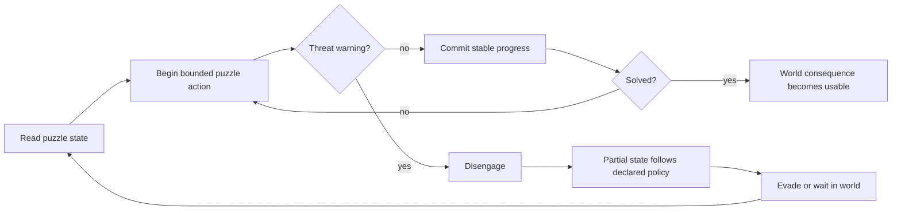

# Worldview Game — Threat-Interrupted Puzzle

Build a playable world puzzle that demands attention while an active threat forces the player to disengage, seek safety, preserve or lose progress under declared rules, and return with enough context to continue.

> **This Skill joins puzzle and threat through state.** The puzzle remains physically situated, interruption is fair and recoverable, committed progress follows an explicit persistence policy, and danger comes from a real system rather than an invisible punishment timer.

## Call this Skill

```text
/worldview-game-threat-interrupted-puzzle

Use the existing pump gallery and roaming threat. Turn the three-ring sluice
console into a world-space puzzle that the player can leave at any moment. Each
locked ring should persist, an unfinished rotation should return to its last
stable notch, and the player should have readable warning before the threat
reaches the console. Verify interruption at every puzzle stage and a clean restart.
```

The Slash name is the stable public entry. The user can provide a running project and puzzle, a map and threat, or only the desired attention-versus-safety experience. The Agent recovers established project rules before proposing state, timing, or content.

## When to use it

Use this Skill when the player repeatedly trades concentration for safety:

1. A puzzle exists in the same playable world as a threat or hazard.
2. Solving requires attention, position, or a temporarily restricted action set.
3. Danger is warned early enough that disengagement is a decision.
4. Leaving the puzzle has a declared effect on partial and committed progress.
5. Returning provides enough state and feedback to resume without guessing what survived.

Do not use it for a pause-screen puzzle where the world stops, a cutscene interruption, an ordinary timed lock with no threat state, a full puzzle-framework request, or a chase that happens only after the puzzle is already complete.

## What you provide

Useful inputs include:

- the authorized project and playable entry;
- the current puzzle, interaction, map, camera, and input behavior;
- the existing threat or environmental pressure and its warning cues;
- intended puzzle steps, stable checkpoints, and completion consequence;
- task owners, possible helper or system handoffs, and partial world effects;
- retreat routes, cover, safe observation, and re-entry points;
- accessibility, platform, and multiplayer requirements.

If no puzzle exists, the Agent proposes the smallest one whose state can be understood, interrupted at several moments, resumed, solved, and reset. Proxy controls and geometry are sufficient for proof.

## What you receive

```text
gameplay/<encounter-slug>/
├── mechanic.md       puzzle, ownership, handoff, interruption and outcome
├── tunables.yaml     action, warning, approach, recovery and feedback values
└── verification.md   interruption matrix, success, failure, restart and evidence
```

Implementation remains in the project’s established source tree. The handoff names the playable entry, controls, reused assets, puzzle state policy, warning and retreat, evidence captured, and claims that remain untested.

## How the Skill proceeds

The Agent fixes four dependent layers before implementation:

1. **Puzzle State Lock:** authoritative values, legal bounded actions, commit boundaries, and the solution.
2. **Interruption Policy Lock:** what persists, reverts, checkpoints, saves, loads, and clears for every interruption.
3. **Threat Window Lock:** warning event, disengagement timing, recovery routes, repeat opportunity, and fair overstay failure.
4. **Completion Consequence Lock:** one solved transaction, world subscribers, load/reconnect behavior, and usable success boundary.

A puzzle, persistence, route, timing, or consequence change reopens the earliest affected layer. Its dependent save fixtures, margins, and playthrough evidence must be rerun before implementation continues.

## The interrupted attention loop



The player should be able to explain what the threat interrupted, what persisted, and what must be done next. Surprise belongs in the encounter; state loss does not need to be mysterious.

## Read the method

[Read the full Agent method](SKILL.md) · [See the contract template](templates/mechanic-contract.md) · [Read why the mechanic works](references/why-this-mechanic-works.md) · [Open the original fictional example](examples/tidewheel-console.md) · [Review source provenance](SOURCE.md)
