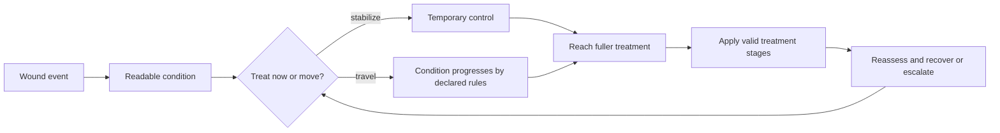

# Worldview Game — Wounds, Infection, and Treatment

Build a survival-health loop in which an injury creates readable, time-dependent treatment decisions. The system tracks fictional wound state, contamination or infection risk, treatment progress, and recovery without presenting illness or disability as moral failure, corruption, or loss of personhood.

> **This Skill creates game rules, not medical guidance.** Realistic medical claims require qualified review and project-approved sources; the default method stays explicitly fictional and abstract.

## Call this Skill

```text
/worldview-game-wounds-infection-and-treatment

Use the existing greenhouse route. A broken irrigation tube can cause a wound
with fictional contamination risk. Let the player inspect it, stabilize it,
reach a wash station, apply a clinic treatment pack, and reassess the condition.
Make every stage readable without color or sound alone, and include a reduced-
intensity presentation option that preserves the decisions.
```

The Slash brief may identify a project, hazard, desired resource pressure, treatment location, and tone. The Agent first recovers the project's current health and time models before proposing states or effects.

## When to use it

Use this Skill when injury should create a sustained but recoverable chain of decisions:

1. the player can identify that a wound state exists;
2. delaying or choosing among treatments changes a declared fictional progression;
3. supplies, time, safety, or route access make treatment consequential;
4. symptoms and treatment response remain legible; and
5. escalation, recovery, failure, restart, and persistence can be verified.

Do not use it for instant damage-only health, purely cosmetic injury, real-world diagnosis or first-aid instruction, a morality system that treats illness as guilt, or a transformation story that erases a person's humanity by analogy with real disability or disease.

## What you provide

Useful inputs include:

- existing health, damage, status, inventory, time, rest, and save systems;
- the fictional hazard and declared world rules governing exposure;
- treatment resources and locations already present in the project;
- intended route pressure and acceptable presentation intensity;
- accessibility, content-safety, localization, and multiplayer requirements;
- approved expert material if the user explicitly requests medical realism.

The Agent separates project facts, runtime observations, fictional proposals, and any reviewed real-world claims. It does not invent dosages, diagnoses, or clinical timelines.

## What you receive

```text
gameplay/<treatment-loop-slug>/
├── mechanic.md          wound states, decisions, feedback and outcomes
├── condition-model.md   progression, treatment and persistence transitions
├── tunables.yaml        fictional rates, thresholds, costs and assists
└── verification.md      route, boundary, save, accessibility and authority checks
```

When the runtime is available, the delivery includes the working loop in the existing project, a playable entry point, controls, and evidence for prompt treatment, delayed treatment, invalid and interrupted attempts, exact resource charges, post-escalation recovery, save/load, restart, reduced-intensity presentation, and network behavior if claimed.

## How the Skill proceeds

The Agent first fixes the **Fiction and Representation Lock**, then defines independent dimensions in the **Condition Model Lock**. The **Clock Policy Lock** makes time and lifecycle behavior explicit; the **Treatment Route Lock** ties fictional thresholds and interventions to resources, travel, reassessment, and assists; the **Persistence and Authority Lock** fixes identity, save, restart, and multiplayer semantics. Implementation begins after those artifacts agree. A contradiction reopens the earliest affected lock and invalidates its dependent traces and reviews.

## The treatment loop



The mechanic should make the world feel dangerous without pretending that real illness is a punishment, a personal defect, or a reliable source of monstrosity.

## Read the complete method

[Agent instructions](SKILL.md) · [Mechanic contract](templates/mechanic-contract.md) · [Original-source record](SOURCE.md) · [Why the mechanic works](references/why-this-mechanic-works.md) · [Example: The Glass Orchard](examples/glass-orchard-infirmary.md)
